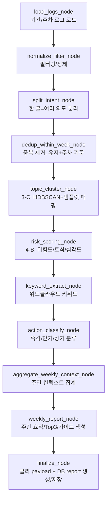

```mermaid
flowchart TD
  A[load_logs_node<br/>기간/주차 로그 로드] --> B[normalize_filter_node<br/>필터링/정제]
  B --> C[split_intent_node<br/>한 글=여러 의도 분리]
  C --> D[dedup_within_week_node<br/>중복 제거: 유저+주차 기준]
  D --> E[topic_cluster_node<br/>3-C: HDBSCAN+템플릿 매핑]
  E --> F[risk_scoring_node<br/>4-B: 위험도/토식/심각도]
  F --> G[keyword_extract_node<br/>워드클라우드 키워드]
  G --> H[action_classify_node<br/>즉각/단기/장기 분류]
  H --> I[aggregate_weekly_context_node<br/>주간 컨텍스트 집계]
  I --> J[weekly_report_node<br/>주간 요약/Top3/가이드 생성]
  J --> K[finalize_node<br/>클라 payload + DB report 생성/저장]
```