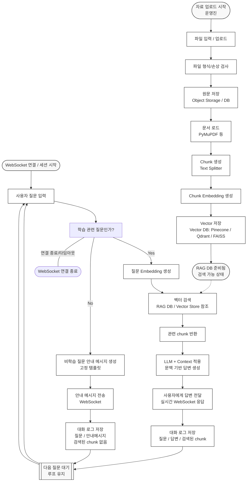

```mermaid
flowchart TB
  %% --- WebSocket / User loop ---
  WS_START([WebSocket 연결 / 세션 시작])
  A[사용자 질문 입력]
  B[학습 관련 질문인가?]
  C[질문 Embedding 생성]
  D[벡터 검색<br/>RAG DB / Vector Store 참조]
  E[관련 chunk 반환]
  F[LLM + Context 적용<br/>문맥 기반 답변 생성]
  G[사용자에게 답변 전달<br/>실시간 WebSocket 응답]
  H[대화 로그 저장<br/>질문 / 답변 / 검색된 chunk]
  LOOP[[다음 질문 대기<br/>루프 유지]]

  %% --- 비학습 branch ---
  I[비학습 질문 안내 메시지 생성<br/>고정 템플릿]
  J[안내 메시지 전송<br/>WebSocket]
  K[대화 로그 저장<br/>질문 / 안내메시지<br/>검색된 chunk 없음]

  %% --- 자료 업로드 / RAG 준비 프로세스(운영진) ---
  UP_START([자료 업로드 시작<br/>운영진])
  U1[파일 입력 / 업로드]
  U2[파일 형식/손상 검사]
  U3[원문 저장<br/>Object Storage / DB]
  U4[문서 로드<br/>PyMuPDF 등]
  U5[Chunk 생성<br/>Text Splitter]
  U6[Chunk Embedding 생성]
  U7[Vector 저장<br/>Vector DB: Pinecone / Qdrant / FAISS]
  RAG_READY([RAG DB 준비됨<br/>검색 가능 상태])

  %% --- 연결(화살표) ---
  WS_START --> A
  A --> B

  %% 학습 관련(Yes) 흐름
  B -- Yes --> C
  C --> D
  D --> E
  E --> F
  F --> G
  G --> H
  H --> LOOP
  LOOP --> A

  %% 비학습(No) 흐름
  B -- No --> I
  I --> J
  J --> K
  K --> LOOP
  LOOP --> A

  %% RAG 준비 흐름 (운영진)
  UP_START --> U1 --> U2 --> U3 --> U4 --> U5 --> U6 --> U7 --> RAG_READY
  RAG_READY -.-> D

  %% 스타일
  classDef proc fill:#ffffff,stroke:#111,stroke-width:1px;
  classDef status fill:#f8f8f8,stroke:#111,stroke-width:1px;

  class A,C,D,E,F,G,H,I,J,K,U1,U2,U3,U4,U5,U6,U7 proc;
  class WS_START,UP_START,RAG_READY,LOOP,status status;

  %% WebSocket 종료
  WS_END([WebSocket 연결 종료])
  B ---|연결 종료/타임아웃| WS_END
```